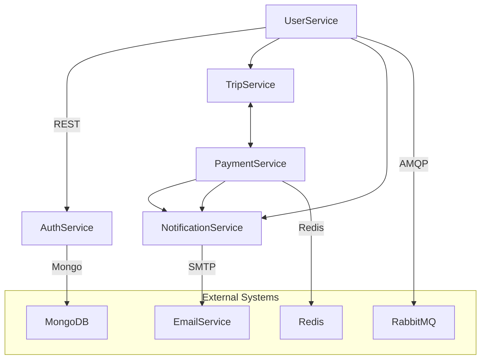

<h1 align="center">🌌 Aurora Voyages</h1>
<p align="center"><b>Microservices-Based Travel Booking Platform</b></p>

<p align="center">
  
  
  
</p>

---

## 🌍 Overview

**Aurora Voyages** is a full-featured, cloud-native **travel booking application** built using **microservices architecture**. Designed as a course project, it demonstrates modern practices such as **Docker-based containerization**, **RESTful API design**, **inter-service messaging**, and **scalable service orchestration**. The platform simulates a real-world travel ecosystem — enabling everything from user registration to trip booking, payments, and real-time notifications.

---

## 📚 Table of Contents

* [🌍 Overview](#-overview)
* [📦 Features](#-features)
* [🔧 Architecture](#-architecture)
* [⚙️ Installation](#️-installation)
* [🚀 Usage](#-usage)
* [🧪 API Testing](#-api-testing)
* [📁 Project Structure](#-project-structure)
* [🔧 Configuration](#-configuration)
* [📚 Documentation](#-documentation)
* [🐞 Troubleshooting](#-troubleshooting)
* [🛠️ Future Improvements](#️-future-improvements)
* [🤝 Contributors](#-contributors)
* [📄 License](#-license)

---

## 📦 Features

✅ Modular architecture with isolated services
✅ Dockerized for easy deployment and reproducibility
✅ RESTful APIs for all major operations
✅ Real-time communication using RabbitMQ
✅ Email notifications via SMTP
✅ MongoDB and Redis integration
✅ Health checks and utility scripts
✅ Configurable and scalable

---

## 🔧 Architecture



> Each service is fully encapsulated with its own database, environment configuration, and API endpoint.

---

## ⚙️ Installation

> 🛠 Prerequisites: Ensure **Docker** and **Docker Compose** are installed.

```bash
# Clone the repository
git clone <repo-url>
cd AuroraVoyages-courseProject

# Build and launch the platform
docker-compose up --build
```

✅ After deployment, verify service health:

```bash
# For Linux/macOS
./test-services.sh

# For Windows
check-services.bat
```

---

## 🚀 Usage

* **Frontend UI**: `http://localhost:3000`
* **Sample API Endpoint**: `http://localhost:8001/api/users`

📬 Run test requests using:

```bash
node test-api.js
```

---

## 🧪 API Testing

Example: User Registration Request

```http
POST /api/users/register
Content-Type: application/json

{
  "name": "Sarim",
  "email": "sarim@example.com",
  "password": "securepass"
}
```

> Full API details are documented in each service's sub-directory.

---

## 📁 Project Structure

```
AuroraVoyages-courseProject/
├── api-gateway/
│   ├── logs/
│   └── src/
│       ├── config/
│       ├── middleware/
│       ├── routes/
│       ├── services/
│       └── utils/
├── auth-service/
│   ├── logs/
│   └── src/
│       ├── config/
│       ├── controllers/
│       ├── middleware/
│       ├── models/
│       ├── routes/
│       ├── services/
│       └── utils/
├── backend/
│   ├── cache/
│   ├── config/
│   ├── data/
│   ├── middleware/
│   ├── models/
│   ├── routes/
│   ├── scripts/
│   ├── uploads/
│   └── utils/
├── forum-service/
│   ├── cmd/
│   │   └── server/
│   ├── internal/
│   │   ├── config/
│   │   ├── controllers/
│   │   ├── middleware/
│   │   ├── models/
│   │   ├── repository/
│   │   ├── routes/
│   │   ├── services/
│   │   └── utils/
│   └── migrations/
├── frontend/
│   ├── public/
│   │   ├── api/
│   │   ├── images/
│   │   └── uploads/
│   └── src/
│       ├── components/
│       │   ├── ar/
│       │   ├── auth/
│       │   ├── charts/
│       │   ├── common/
│       │   ├── culture/
│       │   ├── destinations/
│       │   ├── forum/
│       │   ├── inspiration/
│       │   ├── itinerary/
│       │   ├── layout/
│       │   ├── maps/
│       │   ├── notifications/
│       │   ├── packages/
│       │   ├── payment/
│       │   ├── pdf/
│       │   ├── regulations/
│       │   ├── routing/
│       │   ├── search/
│       │   ├── transport/
│       │   ├── ui/
│       │   ├── uploads/
│       │   ├── utils/
│       │   ├── vr/
│       │   └── weather/
│       ├── context/
│       ├── pages/
│       │   ├── admin/
│       │   ├── forum/
│       │   ├── inspiration/
│       │   └── tourGuide/
│       ├── services/
│       ├── tests/
│       └── utils/
├── logs/
├── mysql/
│   └── init/
├── payment-service/
│   ├── app/
│   │   ├── controllers/
│   │   ├── models/
│   │   ├── routes/
│   │   ├── services/
│   │   └── utils/
│   └── logs/
└── redis/
```

---

## 🔧 Configuration

Each microservice uses environment variables (defined in `.env` files) for runtime configuration.

### Common Variables

| Variable            | Description                        |
| ------------------- | ---------------------------------- |
| `API_PORT`          | Port the service runs on           |
| `DB_URI`            | MongoDB or Redis connection string |
| `MAIL_CONFIG`       | SMTP credentials for email service |
| `JWT_SECRET`        | Secret key for auth service        |
| `SERVICE_ENDPOINTS` | URLs for internal service calls    |

🔄 Modify `docker-compose.override.yml` for local development overrides.

---

## 📚 Documentation

Comprehensive documentation is available in the `docs/` directory:

* 📄 [`MICROSERVICES-README.md`](./docs/MICROSERVICES-README.md) – Service breakdown and responsibilities
* 🧱 [`implementation-steps.md`](./docs/implementation-steps.md) – Deployment and testing guidance
* 🧭 [`microservices-implementation-plan.md`](./docs/microservices-implementation-plan.md) – Design rationale and planning

---

## 🐞 Troubleshooting

| Problem                   | Solution                                        |
| ------------------------- | ----------------------------------------------- |
| 🧱 Port conflict          | Update ports in `docker-compose.override.yml`   |
| 🐌 Service not responding | Rebuild with `docker-compose up --build`        |
| ❌ DB connection failed    | Verify `DB_URI` in respective `.env` files      |
| 🔍 Missing logs           | Use `docker-compose logs <service>` to diagnose |

---

## 🛠️ Future Improvements

* [ ] Integrate Kubernetes for orchestration
* [ ] Add OAuth2-based authentication
* [ ] Implement logging with ELK stack
* [ ] Add unit & integration tests with CI/CD
* [ ] Convert services to gRPC (optional)

---

## 🤝 Contributors

| Name                                                                 | Role         | Institution                         |
| -------------------------------------------------------------------- | ------------ | ----------------------------------- |
| [Muhammad Sarim](https://github.com/M-Sarim)                         | Project Lead | FAST National University CFD Campus |
| [Furqan Buttar](https://github.com/boltbuttar)                       | Developer    | FAST National University CFD Campus |
| [Usman Aamir](https://github.com/UsmanAamir01)                       | Developer    | FAST National University CFD Campus |

---

## 📄 License

This project is licensed under the **MIT License**.
See the [LICENSE](./LICENSE) file for full details.

---
